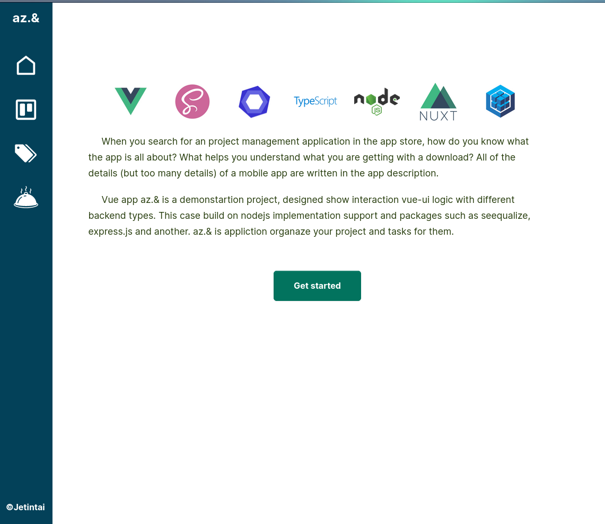
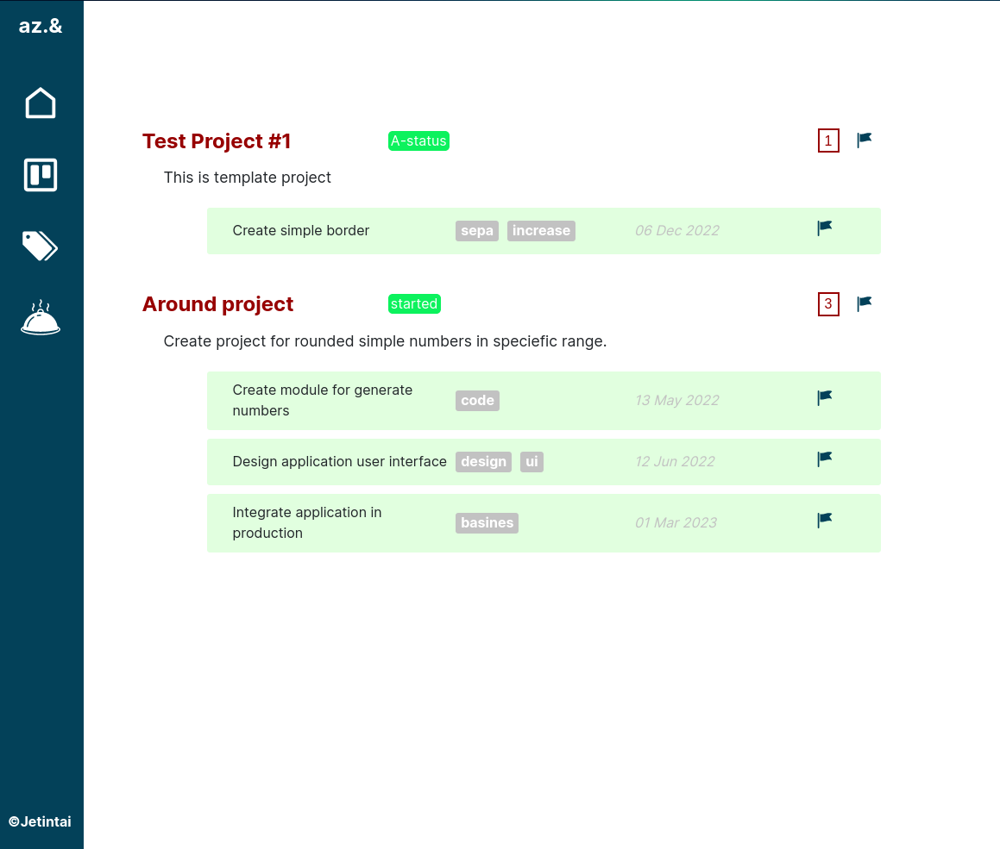

### AZ.& - manage progect
Vue app az.& is a demonstartion project, designed show interaction vue-ui logic with different backend types.
This case build on nodejs implementation support and packages such as seequalize, express.js and another. az.& is
appliction organaze your project and tasks for them.

### Installation
copy project

```angular2html
git clone 
```

install packages
```angular2html
npm install
```
or
```angular2html
yarn install
```

run preview server
```angular2html
npm run serve
```

Go to localhost page http://localhost:8080

### Screenshots

